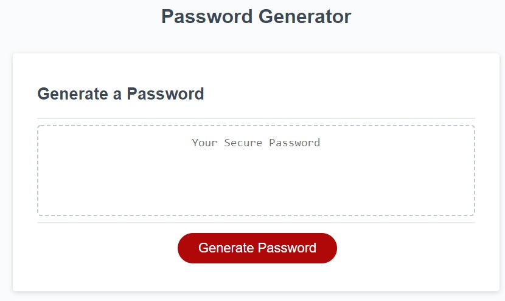

# Password Generator using JavaScript- HussRizk56

For this weeks assignment I created a password generator website. The employee can use this website to create a random and stronge password between 8 and 128 characters. The generator will genrate a password that includes uppercase, lowercase, special characters, or numbers based on the responses. 

## Steps Taken:
* The changes were made using JavaScript. I created variable and arrays to generate the password. The variables were the special characters, numbers, and letters.
* Made sure to include the "if/else" to help with generating the password.
* Used the "for" loop to make sure that the math function was randomized.
* The "return" function was used to have the password to generate on the website created. 
* The end result was to provide a strong and random password that can be used. 

Screen shot:

    

Link: 

